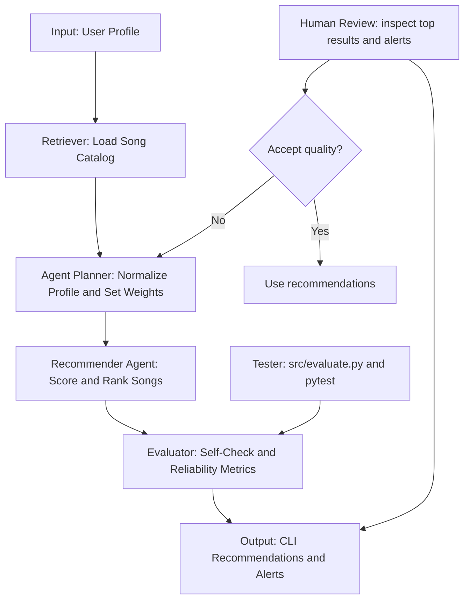
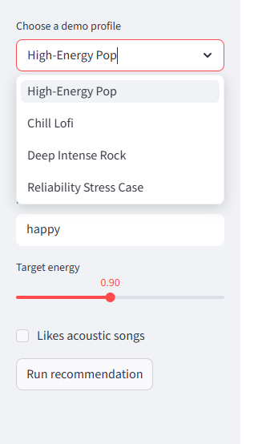
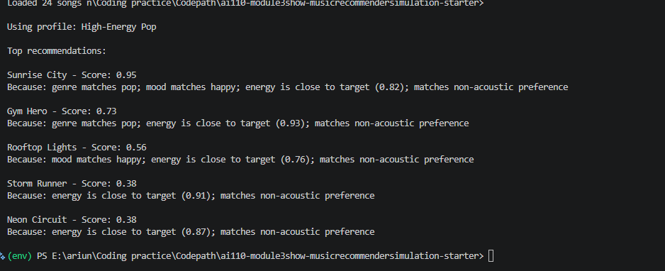
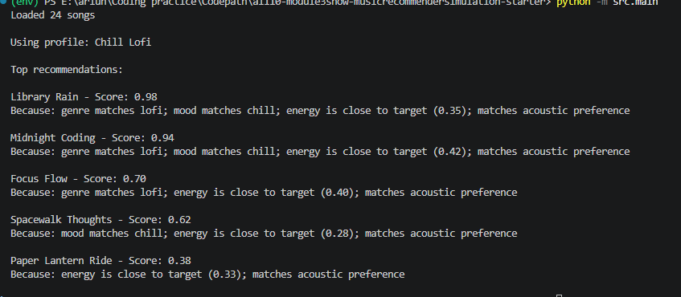

# Music Recommender Simulation with Reliability Loop

## Original Project (Modules 1-3)

**Original project name:** Music Recommender Simulation (CodePath Applied AI Modules 1-3)

The original system used a transparent rule-based scorer to recommend songs from a small CSV catalog based on user preferences (genre, mood, energy, and acousticness). Its core capability was deterministic ranking with simple explanations, mainly for learning how feature matching affects recommendation quality. It was intentionally lightweight and classroom-focused, not a production recommender.

## Title and Summary

This project is a music recommender with an integrated reliability loop. It matters because it demonstrates how an AI-style workflow can go beyond one-pass scoring by adding planning, self-checking, and evaluation before final output.

The upgraded system now:
1. Normalizes and validates user input.
2. Uses an adaptive strategy planner to set scoring behavior.
3. Runs self-checks to revise weak recommendations.
4. Produces reliability metrics and guardrail alerts.

## System Architecture



Component mapping:
1. Retriever: `load_songs` in `src/recommender.py`
2. Agent planner and ranker: `plan_scoring_strategy` and `recommend_songs_with_reliability` in `src/recommender.py`
3. Evaluator: `self_check_and_revise` and `evaluate_reliability` in `src/recommender.py`
4. Tester: `src/evaluate.py` and `tests/test_recommender.py`

## Architecture Overview

The system starts with user input and song retrieval, then the planner sets a scoring strategy before ranking candidates. After ranking, an evaluator runs a self-check and computes reliability signals. Human review and tester scripts validate whether outputs are acceptable, and low-quality outcomes can be routed back to the planner stage for refinement.

## Setup

1. Create and activate a virtual environment:

```bash
python -m venv .venv
# Windows
.venv\Scripts\activate
# macOS/Linux
source .venv/bin/activate

```

2. Install dependencies:

```bash
python -m pip install -r requirements.txt
```

3. Run the main application:

```bash
python -m src.main
```

4. Run the reliability harness:

```bash
python -m src.evaluate
```

5. Run tests:

```bash
python -m pytest -q
```

## Run End-to-End System

```bash
python -m src.main
```

The CLI runs 3 example profiles end-to-end:
1. High-Energy Pop
2. Chill Lofi
3. Deep Intense Rock

Each run prints:
1. Top recommendations
2. Per-song explanation
3. Reliability summary with consistency and guardrail alerts

## Reliability and Guardrail Harness

Run the evaluation harness:

```bash
python -m src.evaluate
```

This includes 3 evaluator scenarios:
1. `baseline_pop` for normal behavior.
2. `unknown_labels` to test unsupported genre and mood labels.
3. `invalid_energy` to verify clipping and planner warnings for out-of-range energy values.

## Streamlit Demo UI

Run the interactive demo UI with:

```bash
python -m streamlit run streamlit_app.py
```

The UI lets you choose a built-in demo profile or switch to Custom mode, where genre and mood are selected from catalog values and the energy/acoustic settings can be adjusted freely. You can run the full system end to end and inspect the recommendation table plus reliability alerts in one place.

## Tests

```bash
python -m pytest -q
```

Current tests cover:
1. Recommender ranking behavior.
2. Explanation generation.
3. Planner guardrails for invalid inputs.
4. Reliability report output shape.
5. Backward-compatible recommendation API shape.

## Sample Output Snippets

Example 1

Input profile:

```text
genre=pop, mood=happy, energy=0.9, likes_acoustic=False
```

Output from `python -m src.main`:

```text
Using profile: High-Energy Pop
Sunrise City - Score: 0.94
Because: genre matches pop; mood matches happy; energy is close to target (0.82); matches non-acoustic preference
Reliability summary:
- consistency: 0.4
- items flagged by self-check: 0
- alerts: none
```

Example 2

Input profile:

```text
genre=rock, mood=intense, energy=0.95, likes_acoustic=False
```

Output from `python -m src.main`:

```text
Using profile: Deep Intense Rock
Storm Runner - Score: 0.97
Because: genre matches rock; mood matches intense; energy is close to target (0.91); matches non-acoustic preference
Reliability summary:
- consistency: 0.3
- alerts: low profile consistency in top recommendations
```

Example 3

Input profile (reliability stress case):

```text
genre=rock, mood=intense, energy=1.8, likes_acoustic=False
```

Output from `python -m src.evaluate`:

```text
Profile: invalid_energy
Consistency: 0.5
Planner warnings: ['energy outside [0,1]; clipped to valid range']
Self-check flagged: 0
Guardrail alerts: []
```

## Design Decisions and Trade-Offs

1. I kept a deterministic weighted scorer so results stay interpretable and easy to debug.
2. I added an adaptive planner instead of a static formula to support profile-sensitive behavior.
3. I used a self-check penalty mechanism for reliability instead of a full LLM critic, which keeps runtime and complexity low.
4. Trade-off: this architecture improves transparency and reproducibility, but it cannot capture deep semantic taste patterns like neural recommenders.

## Experiment Notes

1. For extreme energy preferences, boosting energy weight improved intuitive top picks for intense profiles.
2. When acoustic preference is unknown, reducing acoustic weight lowered noisy matches.
3. The self-check penalty reduced weakly justified recommendations near the top of the list.

## Limitations

1. Catalog quality is still limited by synthetic entries and no real user behavior logs.
2. The model does not use listening history, lyrics, or context.
3. Consistency metric is simple profile alignment, not human preference ground truth.

## Testing Summary

What worked:
1. End-to-end recommendations were generated consistently for all predefined profiles.
2. Reliability evaluator correctly surfaced low-consistency alerts.
3. Guardrail behavior correctly handled invalid energy values via clipping and warnings.

What did not work well:
1. Consistency metric is still coarse and does not represent true user preference accuracy.
2. Small catalog size can make rankings repetitive.
3. Genre-heavy matching can still dominate edge cases.

What I learned:
1. Input validation and post-ranking checks significantly improve trustworthiness.
2. Transparent heuristics are easier to inspect, but need careful balancing to avoid bias toward one feature.

## Reflection and Ethics

This project taught me that AI problem-solving is not only about prediction quality, but also about control loops: validate input, generate output, then evaluate and revise. Building the planner and evaluator made it clear that reliability is a design choice, not a side effect.

The main limitations are that the system still relies on synthetic catalog entries, does not understand lyrics or listening history, and can still over-reward genre matching. Those same limits can introduce bias toward the categories that appear most often in the data.

The AI could be misused if someone treated it like a real music taste authority or used it to make unfair assumptions about users. To reduce that risk, I kept the system clearly framed as a classroom simulation, added guardrails for invalid inputs, and included reliability output so weak cases are visible instead of hidden.

What surprised me while testing reliability was that the top results could still look reasonable even when the consistency score was low. That showed me why evaluation needs to check more than surface-level output quality.

I used AI assistance to iterate on system design, edge-case handling, and test expansion. One helpful suggestion was to add a dedicated reliability stage after ranking instead of only validating inputs once, because it improved observability through consistency scores and alerts. One flawed suggestion was to over-penalize any top result with a single weak signal, which caused good recommendations to drop too aggressively; I corrected that by using a smaller penalty and combining reason count with energy-gap checks.

Future improvements include richer user profiles, diversity-aware ranking, and a stronger evaluator with human-labeled preference sets.

## Walkthrough (Screenshots)

This section documents the Streamlit demo running end-to-end with both built-in profiles and a Custom profile mode. The app is launched with `python -m streamlit run streamlit_app.py`, then each profile is submitted to the same reliability-aware recommendation pipeline.

### 1) Initial System Screen



The initial screen shows the user-controlled inputs: genre, mood, energy, and acoustic preference. After submission, the system executes planner -> scorer -> self-check -> reliability evaluator and returns ranked songs with explanation text and reliability signals.

### 2) Example Input A: High-Energy Pop



Input profile: `genre=pop, mood=happy, energy=0.9, likes_acoustic=False`.

The model returns songs that match a high-energy pop vibe. Explanations explicitly reference genre match, mood match, and energy closeness. Reliability output remains stable for this profile, with no major guardrail concerns.

### 3) Example Input B: Chill Lofi



Input profile: `genre=lofi, mood=chill, energy=0.2, likes_acoustic=True`.

Recommendations shift to calmer, lower-energy, and more acoustic tracks. The explanation strings confirm that mood and acoustic preference strongly influenced ranking. The reliability panel shows how consistency behaves for a contrasting low-energy profile.

### 4) Example Input C: Deep Intense Rock


Input profile: `genre=rock, mood=intense, energy=0.95, likes_acoustic=False`.

Results prioritize intense high-energy rock candidates. Explanations indicate strong alignment on genre, mood, and energy. Reliability signals provide visibility into whether ranking quality remains consistent under a different preference pattern.


In the report, explain that this screenshot demonstrates the system's guardrail behavior when the input is outside the valid range.

The Streamlit app also supports Custom mode, which lets the user choose any available genre and mood from the catalog instead of only using the preset profiles.

## Model Card
See `model_card.md`.

