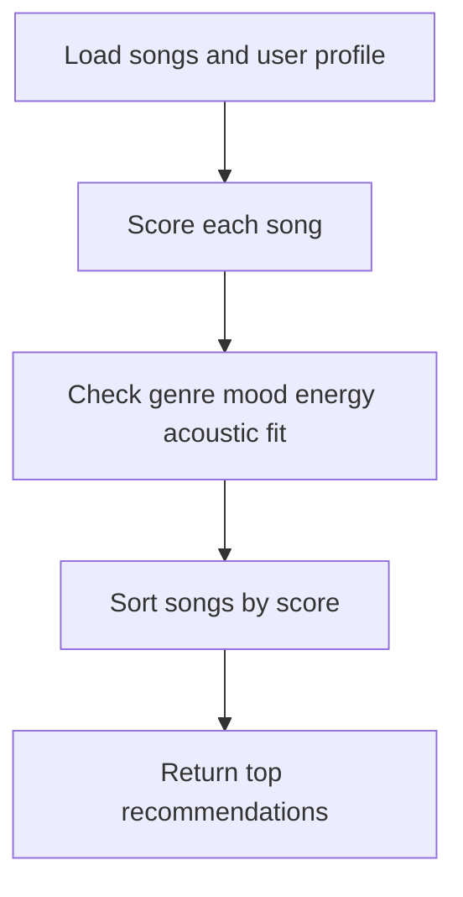
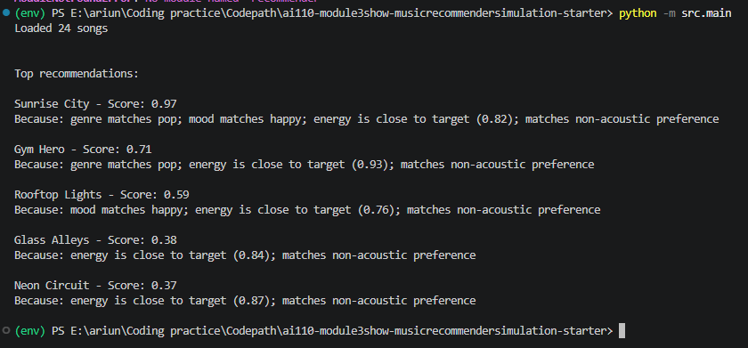
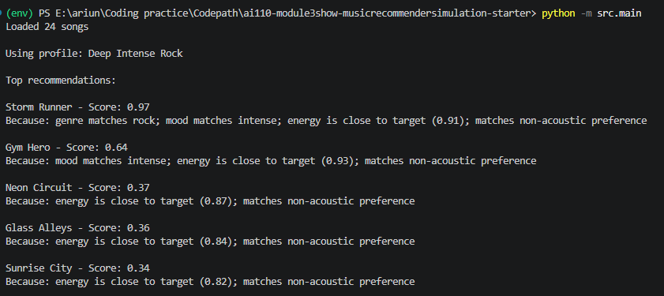

# 🎵 Music Recommender Simulation

## Project Summary

In this project, I built a small music recommender system.

Real recommender systems compare user behavior and song data to suggest good matches. My version is simpler. It compares a user's taste profile with song features and gives each song a score. Songs with higher scores are recommended first.


---

## How The System Works

- Each `Song` uses these features: genre, mood, energy, tempo, valence, danceability, and acousticness.
- My `UserProfile` stores: favorite genre, favorite mood, target energy, and whether the user likes acoustic songs.
- The `Recommender` gives each song a weighted score. It checks genre match, mood match, energy closeness, and acoustic preference.
- After scoring all songs, the system sorts them from highest score to lowest score and returns the top songs.



### Algorithm Recipe

1. Load all songs from `data/songs.csv`.
2. Read the user profile: favorite genre, favorite mood, target energy, and `likes_acoustic`.
3. For each song, calculate:
   - `genre_match`: 1 if genre matches, else 0
   - `mood_match`: 1 if mood matches, else 0
   - `energy_fit`: `1 - abs(song_energy - target_energy)`
   - `acoustic_fit`: `song_acousticness` if user likes acoustic, otherwise `1 - song_acousticness`
4. Compute final score with simple weights:
   - `score = 0.35*genre_match + 0.25*mood_match + 0.25*energy_fit + 0.15*acoustic_fit`
5. Sort songs by score from high to low.
6. Return top `k` songs and a short explanation.

### Bias Note

This system might over-prioritize genre and miss good songs that match the user's mood and energy but use a different genre label.

### User Profile Screenshots

These screenshots show recommendation outputs for different profile purposes.

#### Initial Recommendation



#### High-Energy Pop Profile


#### Deep Intense Rock Profile



#### Chili Pop Profile


---

## Getting Started

### Setup

1. Create a virtual environment (optional but recommended):

   ```bash
   python -m venv .venv
   source .venv/bin/activate      # Mac or Linux
   .venv\Scripts\activate         # Windows

2. Install dependencies

```bash
pip install -r requirements.txt
```

3. Run the app:

```bash
python -m src.main
```

### Running Tests

Run the starter tests with:

```bash
pytest
```

You can add more tests in `tests/test_recommender.py`.

---

## Experiments You Tried

Use this section to document the experiments you ran. For example:

- What happened when you changed the weight on genre from 2.0 to 0.5
- What happened when you added tempo or valence to the score
- How did your system behave for different types of users

---

## Limitations and Risks

Summarize some limitations of your recommender.

Examples:

- It only works on a tiny catalog
- It does not understand lyrics or language
- It might over favor one genre or mood

You will go deeper on this in your model card.

---

## Reflection

Read and complete `model_card.md`:

[**Model Card**](model_card.md)

Write 1 to 2 paragraphs here about what you learned:

- about how recommenders turn data into predictions
- about where bias or unfairness could show up in systems like this


---

## 7. `model_card_template.md`

Combines reflection and model card framing from the Module 3 guidance. :contentReference[oaicite:2]{index=2}  

```markdown
# 🎧 Model Card - Music Recommender Simulation

## 1. Model Name

Give your recommender a name, for example:

> VibeFinder 1.0

---

## 2. Intended Use

- What is this system trying to do
- Who is it for

Example:

> This model suggests 3 to 5 songs from a small catalog based on a user's preferred genre, mood, and energy level. It is for classroom exploration only, not for real users.

---

## 3. How It Works (Short Explanation)

Describe your scoring logic in plain language.

- What features of each song does it consider
- What information about the user does it use
- How does it turn those into a number

Try to avoid code in this section, treat it like an explanation to a non programmer.

---

## 4. Data

Describe your dataset.

- How many songs are in `data/songs.csv`
- Did you add or remove any songs
- What kinds of genres or moods are represented
- Whose taste does this data mostly reflect

---

## 5. Strengths

Where does your recommender work well

You can think about:
- Situations where the top results "felt right"
- Particular user profiles it served well
- Simplicity or transparency benefits

---

## 6. Limitations and Bias

Where does your recommender struggle

Some prompts:
- Does it ignore some genres or moods
- Does it treat all users as if they have the same taste shape
- Is it biased toward high energy or one genre by default
- How could this be unfair if used in a real product

---

## 7. Evaluation

How did you check your system

Examples:
- You tried multiple user profiles and wrote down whether the results matched your expectations
- You compared your simulation to what a real app like Spotify or YouTube tends to recommend
- You wrote tests for your scoring logic

You do not need a numeric metric, but if you used one, explain what it measures.

---

## 8. Future Work

If you had more time, how would you improve this recommender

Examples:

- Add support for multiple users and "group vibe" recommendations
- Balance diversity of songs instead of always picking the closest match
- Use more features, like tempo ranges or lyric themes

---

## 9. Personal Reflection

A few sentences about what you learned:

- What surprised you about how your system behaved
- How did building this change how you think about real music recommenders
- Where do you think human judgment still matters, even if the model seems "smart"

